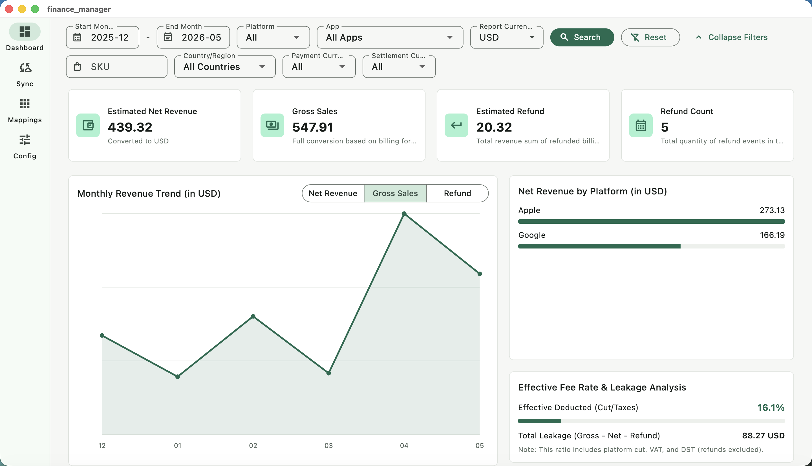
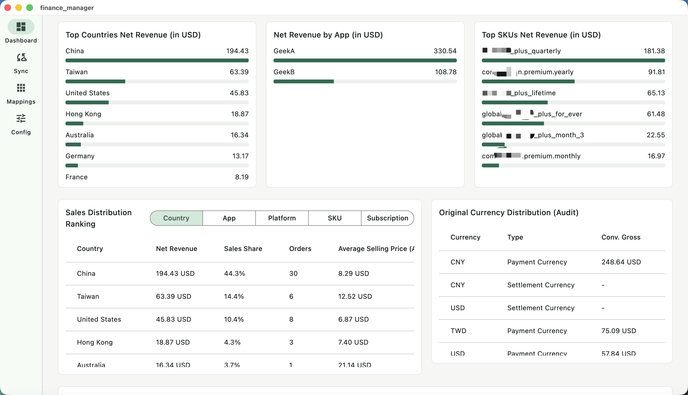
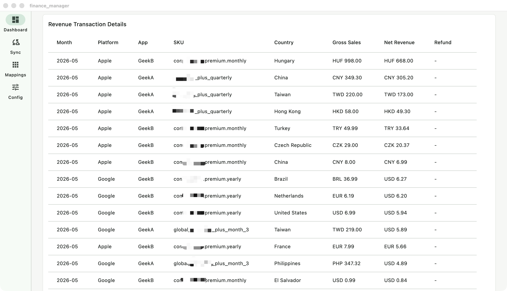

# Store Finance Desk - Privacy-First App Revenue Tracker

[简体中文](README_zh.md)

**Store Finance Desk** is a free, open-source, and privacy-first cross-platform desktop application (macOS / Windows) tailored for **indie developers** to remotely sync, aggregate, and visualize official financial reports from Apple App Store Connect and Google Play—fully locally on your machine.



> [!TIP]
> **Why Store Finance Desk?**
> * **100% Privacy-First**: All App Store Connect API keys, Google JSON credentials, and developer financial records are stored and processed **locally on your own device**. No third-party servers, no logins, no data tracking.
> * **Zero Cost & Open-Source**: A local-first, free-to-use alternative to expensive monthly SaaS tools like Appfigures, RevenueCat, and others. Helper for indie developers to keep track of monthly revenue and margins.

## Key Features

- **Automated Cloud Sync**: Integrates with Apple App Store Connect API and Google Cloud Storage (GCS) to pull official monthly financial reports in the background.
- **Interactive Financial Dashboard**:
  - Net revenue, gross revenue, refunds, and refund rates.
  - Interactive monthly trend charts with period-over-period (MoM) indicators.
  - Multi-dimension rankings (Countries, Apps, Platforms, SKUs, Billing Cycles).
  - Multi-currency support with automatic network-based live exchange rate synchronization.
  - Searchable drop-downs with text filtering (supporting 160+ world currencies).

  

- **Sync History & Data Merging**: Keep track of synced billing periods, record counts, execution times, and errors. Review all converted raw transactions locally in a unified detail table.

  
- **Local Persistence**: Save mappings, API configurations, and cache locally.
- **Privacy First**: Fully self-contained. All credential keys and financial figures are saved locally on your machine.
- **Multi-Language Support (Localization)**: Out-of-the-box localization for 10 languages (English, Simplified Chinese, Traditional Chinese, Japanese, Korean, Spanish, German, French, Portuguese, and Russian) with automatic OS locale detection and a robust fallback mechanism.

## Getting Started

### Prerequisites

Make sure you have [Flutter SDK](https://flutter.dev/docs/get-started/install) installed.

### Run & Build

#### Run Locally (Debug Mode)

Run on macOS:
```bash
flutter run -d macos
```

Run on Windows:
```bash
flutter run -d windows
```

#### Build Release Package

Build for macOS:
```bash
flutter build macos --release
```
*(The compiled `Store Finance Desk.app` will be output to `build/macos/Build/Products/Release/`. For distribution outside the Mac App Store, we recommend signing it with a Developer ID Application certificate and submitting it to Apple's Notary service)*

Build for Windows:
```powershell
flutter build windows --release
```
*(The production package containing binaries and assets will be output to `build\windows\x64\runner\Release\`. You can zip this folder or use Inno Setup to create an installer)*


## Remote Synchronization

To sync your reports automatically, fill in the credentials on the **Config** tab and then head to the **Sync** tab:
1. Specify the start and end months (format: `YYYY-MM`).
2. Click **Sync Reports**.
3. The app will sync Apple and Google Play reports concurrently; a failure in one platform will not prevent the other from loading.

### Apple Connect credentials:
- **Issuer ID**
- **Key ID**
- **Vendor Number**
- **Private Key Content (p8)**

### Google Play credentials:
- **Google Play Cloud Storage Bucket ID** (e.g., `pubsite_prod_rev_...`)
- **Service Account Private Key (JSON)**

## Data Storage

All runtime state and configuration files are saved locally:
- **macOS**: `~/Library/Application Support/store_finance_desk/state.json`
- **Windows**: `%APPDATA%\StoreFinanceDesk\state.json`

## Development & Testing

Format and verify code quality before submitting PRs:
```bash
dart format .
flutter analyze
flutter test
```

## Feedback & Support

* **Issues & Requests**: Please submit bug reports, suggestions, or feature requests via GitHub Issues.
* **100% Privacy Assurance**: The developers of this application have zero visibility or access to your credentials, database stats, or financial records.

## License

This project is licensed under the [MIT License](LICENSE).
