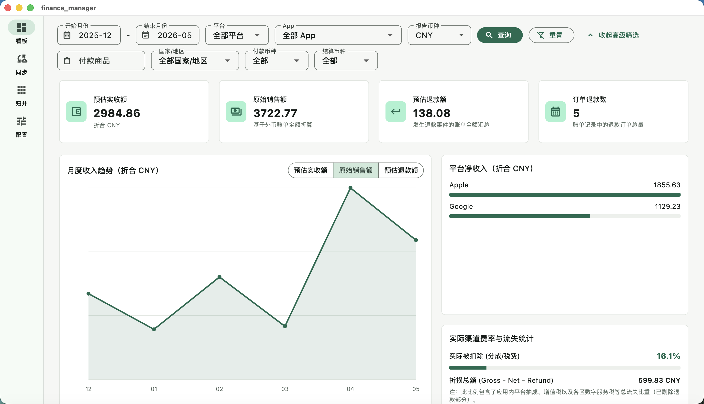
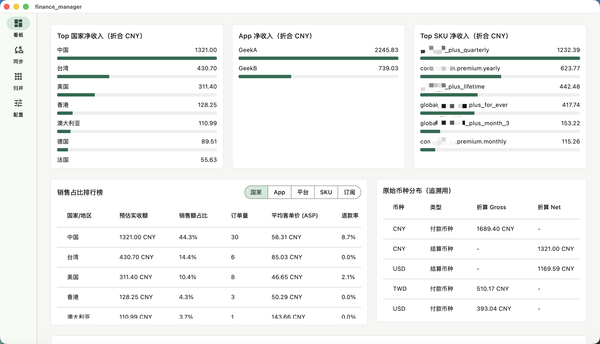
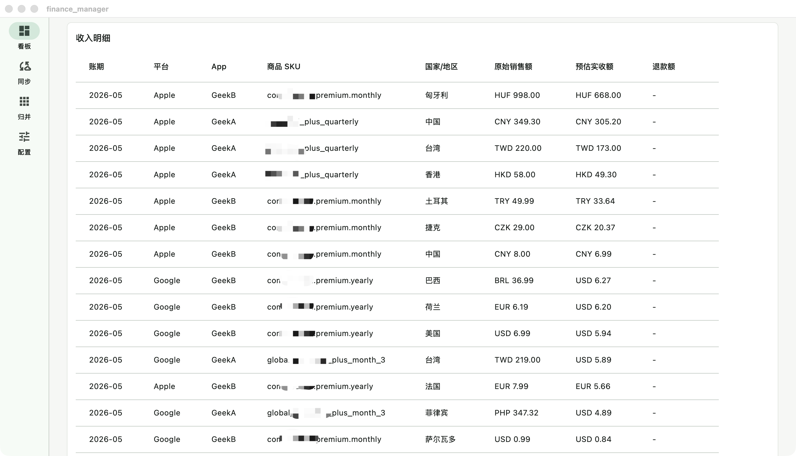

# Store Finance Desk - 独立开发者 App 收入财务看板 (本地私密安全)

[English](README.md)

**Store Finance Desk** 是一款专为**独立开发者**打造的、完全免费开源且隐私安全的跨平台桌面客户端（支持 macOS / Windows）。它能够帮助您在本地一键同步、聚合与可视化 Apple App Store Connect 和 Google Play 的官方财务报表，帮助您高效追踪应用月度流水与退款详情。



> [!TIP]
> **为什么选择 Store Finance Desk？**
> * **100% 隐私安全（Privacy-First）**：所有的 App Store Connect API 密钥、Google Play 服务账号凭证及原始销售报表，完全安全地加密存储在**您本地的设备上**。应用无网络数据追踪、不经由任何第三方服务器、无需注册，数据主权完全归您所有。
> * **完全免费与开源**：作为 Appfigures、RevenueCat 等高额按月订阅制商业 SaaS 工具的本地零成本替代方案，轻松帮助小微及独立开发者实现多平台数据闭环。

## 核心功能

- **远程云端同步**：对接 Apple App Store Connect API 与 Google Cloud Storage (GCS)，在后台自动静默拉取指定月份范围内的官方财务报表。
- **交互式收入看板**：
  - 统计净收入、总收入、退款金额和退款率。
  - 交互式月度趋势折线图，支持平滑展示环比（MoM）变化。
  - 多维度排行榜（国家/地区、应用、平台、SKU、订阅周期等）。
  - 多货币支持，每次启动时静默自动同步最新网络全球汇率。
  - 精美的可搜索过滤的币种选择下拉框（支持 160+ 个全球币种）。

  

- **同步历史与明细归并**：记录每次云端同步的账期、记录条数、耗时以及错误日志，支持在本地一键查阅所有汇率折算后的原始账单明细。

  
- **本地持久化**：应用数据、账号配置及汇率缓存完全保存在本机数据目录下。
- **隐私保护**：安全无毒，所有 API 密钥、报表数据与财务金额完全留存在本地设备，不经由任何第三方服务器。
- **多语言与本地化支持**：原生支持 10 种常用语言（英语、简体中文、繁體中文、日本語、한국어、Español、Deutsch、Français、Português、Русский），启动时自动检测宿主系统语言并适配，且内置平滑的英文（en）兜底降级（Fallback）机制。

## 运行与编译

### 前提条件

请确保本机已安装 [Flutter SDK](https://flutter.dev/docs/get-started/install)。

### 运行与打包

#### 本地调试运行 (Debug 模式)

在 macOS 上运行：
```bash
flutter run -d macos
```

在 Windows 上运行：
```bash
flutter run -d windows
```

#### 生成正式发布包 (Release 模式)

macOS 平台：
```bash
flutter build macos --release
```
*(生成的 `Store Finance Desk.app` 将输出在 `build/macos/Build/Products/Release/` 目录下。如需在 Mac App Store 之外独立分发，建议您使用 Developer ID Application 证书进行签名并提交至苹果官方公证)*

Windows 平台：
```powershell
flutter build windows --release
```
*(生成的包含二进制与资源文件的完整生产包将输出在 `build\windows\x64\runner\Release\` 下。您可将该目录打包为 ZIP，或使用 Inno Setup 制作专业的安装向导)*


## 远程云端同步

若需开启自动同步，请先在**配置**页面填入各平台 API 凭证，然后前往**同步**页面：
1. 填入开始账期和结束账期（格式：`YYYY-MM`）。
2. 点击**同步官方报表**。
3. 应用将并发请求 Apple 与 Google 服务；其中一个平台的错误不会阻碍另一个平台的成功同步与入库。

### Apple 凭证要求：
- **Issuer ID**
- **Key ID**
- **Vendor Number**
- **私钥文本内容 (p8)**

### Google 凭证要求：
- **Google Play 报表 GCS Bucket ID**（格式例如 `pubsite_prod_rev_...`）
- **服务账号私钥 (JSON)**

## 本地数据存储

所有的运行状态和配置文件均保存在本机：
- **macOS**: `~/Library/Application Support/store_finance_desk/state.json`
- **Windows**: `%APPDATA%\StoreFinanceDesk\state.json`

## 代码规范与测试

在提交 PR 或合并代码前，请确保通过格式化与静态测试：
```bash
dart format .
flutter analyze
flutter test
```

## 反馈与支持

* **问题与建议**：若您在使用中遇到任何 Bug、有任何功能建议，欢迎通过 GitHub Issues 提交您的意见，我会积极跟进并解决。
* **100% 隐私承诺**：作为开源软件，应用开发者没有任何途径或能力获取您的任何 API 密钥、本地财务数据库及金额统计数据。

## 开源协议

本项目采用 [MIT 协议](LICENSE) 开源。
